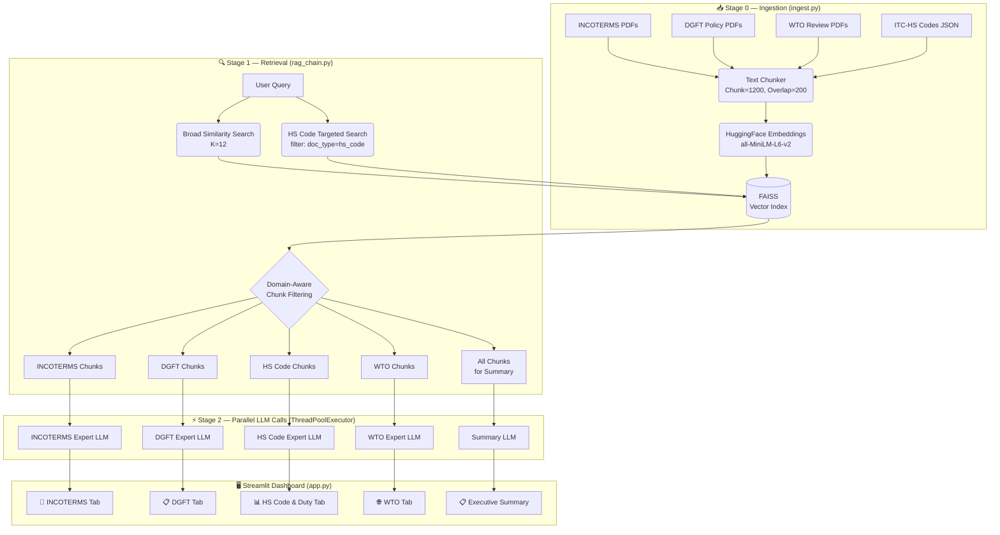

# 🚢 TradeComply AI

<div align="center">

**Intelligent Logistics Regulation & INCOTERMS Knowledge Base — Powered by RAG**

[](https://python.org)
[](https://streamlit.io)
[](https://langchain.com)
[](https://groq.com)
[](https://faiss.ai)
[](./LICENSE)

*Built for the **Gen AI Hackathon 2026***

</div>

---

## 📌 Overview

**TradeComply AI** is an enterprise-grade Retrieval-Augmented Generation (RAG) system designed for export managers, freight forwarders, customs brokers, and trade compliance teams.

It ingests and semantically indexes complex international trade regulatory documents and provides **structured, citation-backed, multi-domain answers** to natural language queries — in **English**.

### Knowledge Base Covers:
| Domain | Source |
|---|---|
| 📘 **INCOTERMS 2020** | ICC Rules (Full handbook) |
| 📋 **DGFT Foreign Trade Policy** | FTP 2023 + Notifications |
| 📊 **ITC-HS Customs Tariff** | Top 100+ HS codes with BCD & IGST rates |
| 🌐 **WTO Trade Policy Reviews** | India TPR + Bound/Applied Tariff Analysis |

---

## ✨ Features

### 🧠 Two-Stage Per-Domain RAG Architecture
The core innovation: instead of one LLM call for everything, the system runs **5 parallel LLM calls** — one dedicated expert per domain and one for the executive summary. Each domain expert sees only its relevant document chunks, producing rich, focused answers with zero context dilution.

### 🔍 Unified Trade Query Interface
Ask one question. Get structured answers across all 4 regulatory domains simultaneously, organized into clean tabbed views:
- 📘 INCOTERMS tab — Risk transfer, seller/buyer obligations, delivery rules
- 📋 DGFT tab — Import/export licensing, scheme eligibility, compliance steps  
- 📊 HS Code & Duty tab — HS classification + full customs duty table (BCD, SWS, IGST)
- 🌐 WTO tab — Bound vs. applied tariff rates, trade policy review insights

### 💹 Deterministic Customs Duty Calculator
Computes the full Indian customs duty cascade mathematically:
```
BCD = Assessable Value × BCD%
SWS = BCD × 10%
IGST = (AV + BCD + SWS) × IGST%
Total Duty = BCD + SWS + IGST
Total Landed Cost = AV + Total Duty
```

### 🛡️ Anti-Hallucination & Integrity Guard
A Python-level interceptor scans every LLM output before rendering:
- **Repetition loop breaker** — detects and truncates any "Final Answer" loop or repeated paragraph before it reaches the UI
- **PDF fragment stripper** — removes garbled mid-sentence fragments from PDF chunk boundaries (e.g. ligature text like `fied place of destination...`)
- **Out-of-scope detection** — if retrieved context doesn't answer the query, the system explicitly states it rather than hallucinating

### 📎 Source Citations
Every answer is backed by source document metadata: file name, chapter, and page number for instant verification.

### 🎨 Premium Dark UI
Built with Streamlit + custom glassmorphism CSS using Plus Jakarta Sans typography, smooth hover animations, and a radial dark gradient theme.

---

## 🏗️ Architecture



---

## 🛠️ Tech Stack

| Layer | Technology |
|---|---|
| **Frontend** | Streamlit 1.38+, Custom CSS (Glassmorphism) |
| **LLM** | Groq API — Llama 3.3 70B Versatile |
| **Orchestration** | LangChain 0.3+ (Chains, Prompts, Parsers) |
| **Embeddings** | HuggingFace `sentence-transformers/all-MiniLM-L6-v2` |
| **Vector Store** | FAISS (CPU) |
| **Structured Output** | Pydantic v2 schemas |
| **PDF Parsing** | pdfplumber + PyPDF2 fallback |
| **Parallelism** | `concurrent.futures.ThreadPoolExecutor` |
| **Evaluation** | RAGAS (Context Precision, Answer Faithfulness) |
| **Environment** | python-dotenv |

---

## 🚀 Quickstart

### Prerequisites
- Python **3.10+**
- A valid **[Groq API Key](https://console.groq.com/)** (free tier available)

### 1. Clone the Repository
```bash
git clone https://github.com/NaveenHuggi/Gen-AI-Hackathon-Project.git
cd Gen-AI-Hackathon-Project
```

### 2. Create a Virtual Environment
```bash
python -m venv venv

# Windows
.\venv\Scripts\activate

# macOS / Linux
source venv/bin/activate
```

### 3. Install Dependencies
```bash
pip install -r requirements.txt
```

### 4. Configure Environment Variables
```bash
cp .env.example .env
```
Edit `.env` and add your key:
```env
GROQ_API_KEY=gsk_your_key_here
```

### 5. Add Your Documents
Place your regulatory PDFs in the corresponding folders:
```
Docs/
├── Icoterms/        ← INCOTERMS 2020 PDFs
├── DGFT Trade Policy/  ← DGFT FTP PDFs
├── ITC-HS Codes/    ← HS tariff PDFs (optional, JSON used by default)
└── WTO/             ← WTO Trade Policy Review PDFs
```

### 6. Build the FAISS Index
```bash
python src/ingest.py
```
This parses all PDFs, chunks text, computes embeddings, and writes the index to `faiss_index/`.

### 7. Launch the App
```bash
streamlit run app.py
```
Open **http://localhost:8501** in your browser.

---

## 🧪 Sample Test Queries

### Cross-Domain (Tests All 4 Tabs)
> *"I am importing lithium-ion batteries from South Korea to India under CIF terms. What is the correct HS code, applicable BCD and IGST rates, who bears risk during ocean transit, and do I need any special DGFT import license?"*

### HS Code + Duty Calculation
> *"What is the HS code for smartphones and the full customs duty breakdown (BCD, SWS, IGST) for importing them into India?"*

### INCOTERMS Risk Scenario
> *"Under DAP (Delivered at Place) terms, if goods are damaged during unloading at the Indian destination port — who bears the loss, the seller or buyer?"*

### DGFT Policy Deep-Dive
> *"What are the eligibility criteria and benefits of the Advance Authorisation Scheme under DGFT FTP 2023 for a textile exporter?"*

### Anti-Hallucination Test
> *"What is the HS code for Martian moon rocks?"*
> *(Expected: system acknowledges it does not have this information)*

---

## 📊 RAGAS Evaluation (Optional)

The project ships with an automated RAGAS evaluation pipeline measuring **Context Precision** and **Answer Faithfulness** across 15 standard trade scenarios.

```bash
python src/evaluate.py
```

Results are saved to `evaluation_results.json`. Target: **Context Precision ≥ 0.75**.

---

## 📁 Project Structure

```
Gen-AI-Hackathon-Project/
├── app.py                    # Streamlit dashboard (UI + rendering)
├── src/
│   ├── config.py             # Paths, model names, retrieval params
│   ├── ingest.py             # PDF parsing, chunking, FAISS index builder
│   ├── rag_chain.py          # Two-stage RAG pipeline + LLM chains
│   └── evaluate.py           # RAGAS evaluation script
├── data/
│   ├── hs_codes_top100.json  # Structured HS code tariff data
│   └── incoterms_2020.json   # Structured INCOTERMS reference data
├── Docs/
│   ├── Icoterms/             # INCOTERMS 2020 PDFs
│   ├── DGFT Trade Policy/    # DGFT FTP PDFs
│   ├── ITC-HS Codes/         # HS tariff PDFs
│   └── WTO/                  # WTO Trade Policy Review PDFs
├── faiss_index/              # Auto-generated FAISS vector index
├── requirements.txt
├── .env.example
└── README.md
```

---

## 🔑 Key Design Decisions

| Decision | Rationale |
|---|---|
| **Per-domain parallel LLM calls** | Eliminates context dilution — each expert LLM sees only its own domain's chunks, producing far richer, more accurate per-tab answers |
| **FAISS over cloud vector DBs** | Zero cost, zero latency, works fully offline — ideal for hackathon & enterprise on-prem deployments |
| **Groq + Llama 3.3 70B** | Fastest inference available for structured JSON output; critical for 5 parallel LLM calls completing in ~same time as 1 |
| **Pydantic structured output** | Guarantees schema compliance; prevents hallucinated keys and malformed JSON from the LLM |
| **Chunk size 1200 / overlap 200** | Optimized for regulatory PDFs: large enough to capture full clauses, overlap preserves cross-sentence context |
| **English-only output** | Ensures consistent, auditable responses; eliminates translation-induced mistranslations of legal terminology |
| **Anti-repetition cleaner** | Python post-processor deduplicates paragraphs and truncates LLM loop patterns before any text reaches the UI |

---

## 📜 License

Developed for the **Gen AI Hackathon 2026**.  
© 2026 TradeComply AI Team. All rights reserved.
